- 🎓 3rd year B.Tech student specializing in Artificial Intelligence & Data Science
- 💻 Learning the fundamentals of Computer Science using *C*, *Java*, and *Python*
- 📈 Consistently in the *topper's list* with a strong foundation in *mathematics*
- 🚀 Currently exploring programming and building my own projects step by step 

|          **My GitHub Stats**          |
|:-------------------------------------:|
|       |
|  |
|     |

---

## Tech Stack

### Languages:

    
    
    
    
    

    
    
    

---

## 🌱 What I'm Working On

As a learner, I’m currently focused on:
- Strengthening my programming skills
- Exploring basic projects to apply my knowledge
- Building a strong foundation for future work in AI and Data Science

---

## Socials

